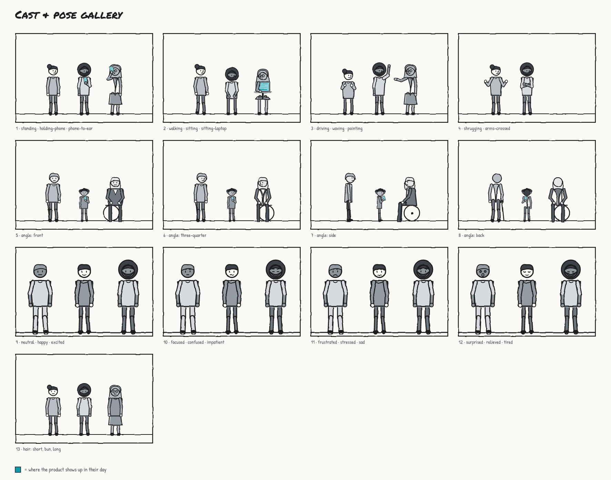

# storyboardkit

Low-fi, sketch-style storyboards for service designers. You describe a customer's day to your coding agent
(Claude Code, Codex, Cursor…), it drafts a storyboard, and you tweak it in a page-first editor. When you're
happy, export images, a slide deck, or a share page people can comment on.

Everything is drawn in a marker-comp style where **the software is the only thing in color (teal)**. A board
shows how small, how late, and how patchy your product's part in someone's day really is. The header says it
outright: *"Product in 3 of 8 moments."*


## Quick start

One step, if Claude Code or Codex is installed:

```bash
npx storyboardkit draft "Sam, a new parent, tries to pay a parking ticket with the city app at 11pm. It wants an account, so Sam mails a check instead"
```

That sets up the folder, has your agent draft and validate the board, then opens the editor.

Or step by step:

```bash
npx storyboardkit init        # AGENTS.md/CLAUDE.md block + agent skill + playground.storyboard.json
npx storyboardkit dev         # opens the editor on your last board
```

Then ask your agent something like:

> Storyboard Priya, an ER nurse, getting a shift-swap request while dropping her kid at school. The app logs
> her out, so she calls a coworker instead. Show where our scheduling app helps and where it doesn't.

## The service-design layer

- **Teal means the product, and nothing else.** Personal calls, texts and other companies' apps are grey.
- **Journey lanes** (top bar) put a strip under every panel: how the person *feels* (−2…2), whether the product
  is there, and their *workaround*. A feeling line runs across the bottom of the page.
- **`storyboard critique <file>`** is a reality check. It flags happy paths: the story starts inside the app,
  the product is in every moment, there's no workaround, the feeling line is flat, or the story ends on a
  screen. It prints a revision request to paste into your agent.

## The editor

- **Click** anything to get its toolbar. The main controls come first, and the rest are under **More**.
  **Ask agent** copies a precise pointer ("panel 5, the bubble `bubble-0`…") to paste into your coding agent.
- **Drag** to move and use the corner handle to resize, including bubbles, captions and cards. Drag an already
  selected panel's background to pan its camera, and use **Camera −/+** to zoom it. Arrow keys nudge.
- **Text** A- / A+ sizes all text on the board. **Zoom** (or **Zoom to panel**) helps with detailed work.
- **Double-click** any text to edit it, including the board title, the persona line and panel labels.
- **Devices:** phones, tablets, laptops and watches can be held. Click the device itself to move it, switch it
  between *Our product* and *Personal*, or **Put down** into the scene. Kiosks, car displays and TVs stand in
  the scene (and can **tilt** away from the viewer), and a phone lying on a table can be handed to someone.
- **Drop a screen image** (PNG/JPG from Figma) onto a device. It's sketchified into the teal palette and fitted.
- **+ Add** has people, **poses** (thumbnails: click, or drag onto a person), bubbles, captions, callouts,
  devices, gestures, and **scene thumbnails** for new panels. **Cast** edits skin tone, hair, body, age, outfit
  and accessories.
- **Copy/paste** (Cmd+C / Cmd+V) panels, people, bubbles and devices, including between boards.
- **Brand** puts your company name or logo on storefronts and signs, in grey.
- **Undo/redo**, a layout picker, and **Export**: PNG (2x/3x), PDF, SVG, **slides** (PPTX, one panel per slide
  with speaker notes), and a **share page** (one HTML file with a comment box per panel; reviewers copy their
  comments back as Markdown).

Your edits save into the same JSON file within a second, as small field-level changes, so git diffs stay
readable. When the agent edits the file, the editor reloads live and keeps your manual nudges.

## CLI

| Command | What it does |
|---|---|
| `draft "<what happens>" [--agent claude\|codex] [--file x]` | Your installed agent drafts the board, then the editor opens |
| `init [dir] [--example]` | AGENTS.md/CLAUDE.md block, the skill (`.agents/skills/`, `.claude/skills/`), and a playground board |
| `vocab [category] [--grep x] [--json]` | Scenes (with marks), shots, poses, moods, devices, bubbles, gestures, cast options |
| `validate <file> [--json]` | Errors with fix-it hints ("did you mean `frustrated`?") plus storytelling suggestions |
| `critique <file>` | A service-design reality check, with a revision request for your agent |
| `dev [file] [--port] [--no-open]` | The editor, with live two-way sync (no file = the last one) |
| `export <file> [--png] [--pdf] [--svg] [--pptx] [--html] [--scale 2] [--out dir]` | Headless export, no browser needed |
| `script <file>` | A readable screenplay version in Markdown |
| `format <file>` / `new <file>` | Canonical formatting / a starter board |

## The file

A storyboard is JSON that describes what happens, not where pixels go. See
[skill/references/format.md](skill/references/format.md) and the [example](examples/late-latte.storyboard.json).
Positions are automatic: characters stand on named marks in a scene (`counter`, `driver-seat`, `sofa`…), and
bubbles place themselves with tails aimed at the speaker's head. The only coordinates in the file are the
editor's sparse `layout` overrides.

**What's included:** 23 scenes (home, work, commute, coffee shop, store, car, hospital, clinic, school,
classroom, airport, hotel, restaurant, gym, parking with EV charger, bus stop, park…) · 6 shots (wide, medium,
close-up, over-the-shoulder, screen, POV) · 11 poses × 4 angles × 3 natural variations · 12 moods · 10 devices ·
speech, thought, shout and whisper bubbles · captions and callouts · title, time-passes and narration cards ·
9 gestures · a cast built from parts: 4 skin tones, 9 hair styles, 4 builds, 3 ages, 8 outfits and 7 accessories.



## Development

```bash
npm install
npm run build        # CLI (esbuild) + schema.json + skill/ (generated from src/vocab.ts) + editor (Vite)
npm test             # unit tests (vitest), incl. a render matrix of every scene × shot and pose × angle × device
npm run e2e          # drives the real editor in Chrome (select, drag, edit, sync, upload, lanes, copy/paste…)
```

`src/vocab.ts` is the single source of truth. The JSON Schema, the validator, `vocab`, the skill's reference
files and the renderer all read it. Don't hand-edit `schema.json` or `skill/`; run `npm run gen`. The docs
say `npx <package name>`, taken from `package.json`, so renaming the package updates them too.

Architecture: `src/render/` is one pure JSON → SVG renderer (React) shared by the editor and the exporter. The
editor adds an overlay for selection and handles. Export uses resvg with bundled fonts. The design decisions
behind all of this are in [.decisions/](.decisions/index.html).

Fonts: Permanent Marker (Apache 2.0), Patrick Hand, Work Sans, IBM Plex Mono (SIL OFL). Licenses are in
`assets/fonts/`.
