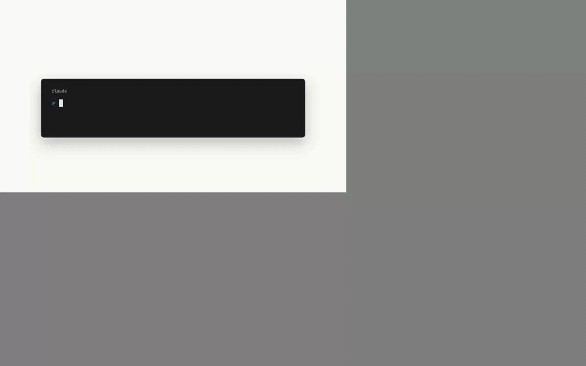
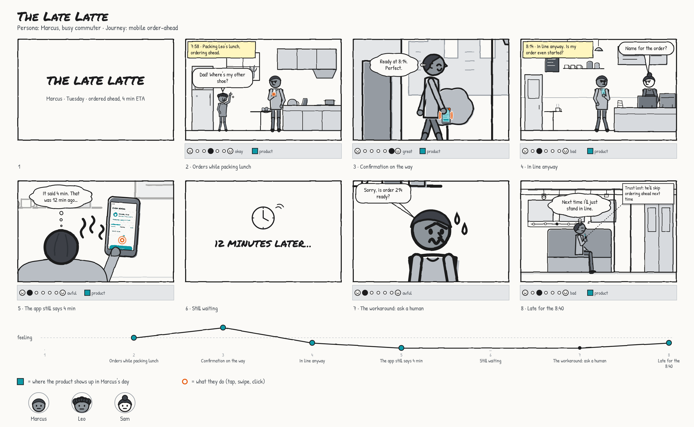
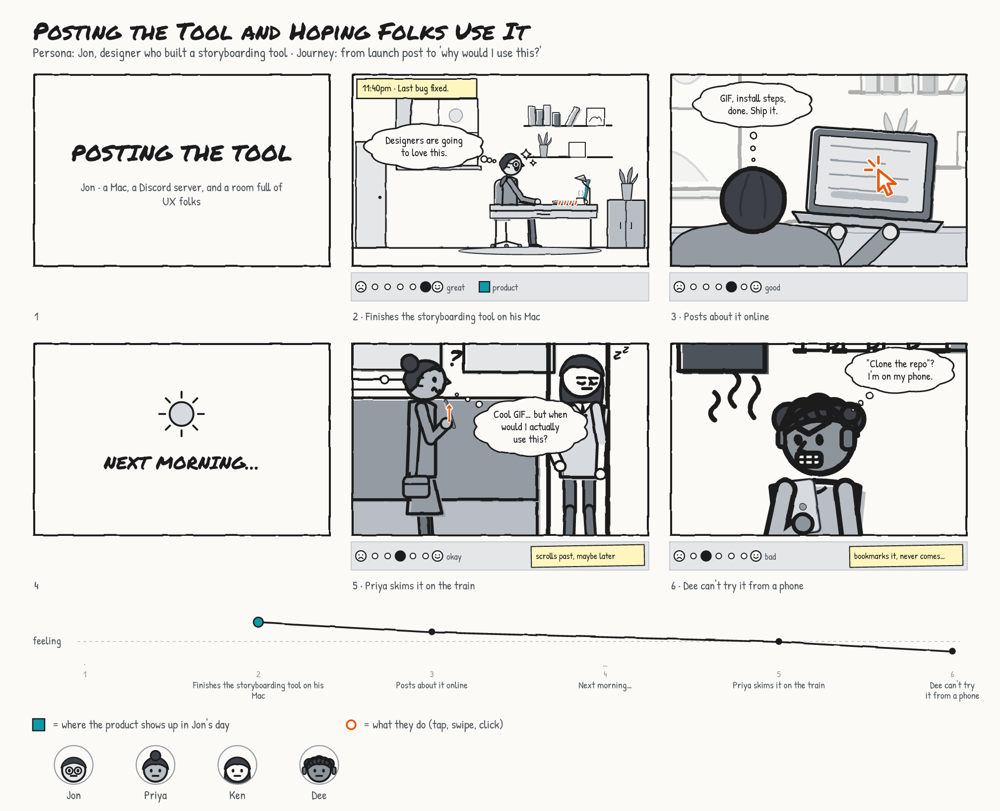
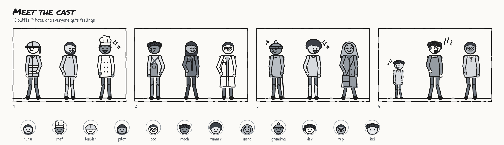
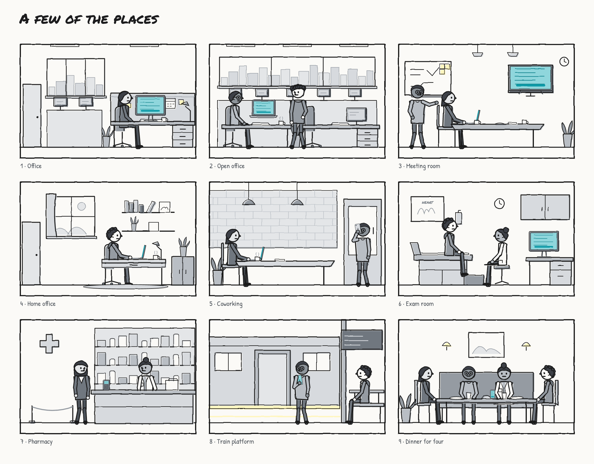
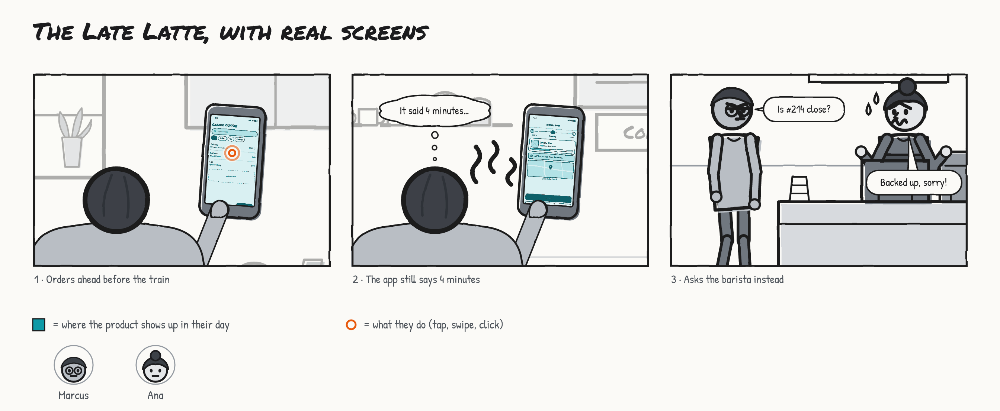
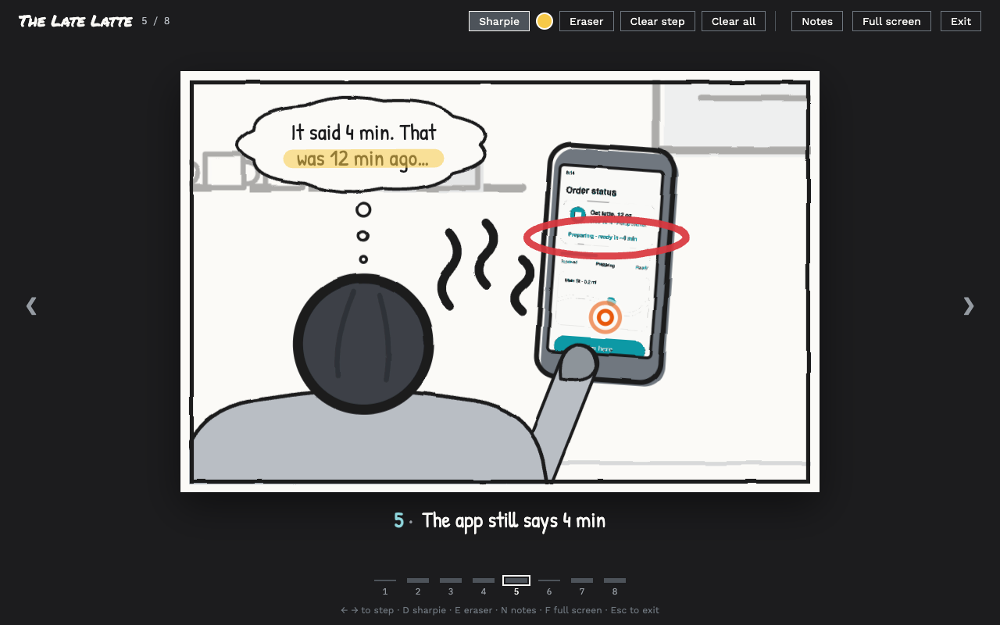

# Storyboard Kit

**Comic strips about your customers, drawn by your coding agent.**

You tell Claude Code (or Codex) what someone's day looks like. It sketches a storyboard. You poke at it in a
little editor until it feels true. Then you drop it in your deck and the room starts talking about the person's
whole day, not just the screens.



## Why though

Most product flows start at the app's home screen. Real life doesn't. People are packing lunch, running late,
asking the barista, texting a friend, screenshotting a code because the app logged them out again.

Storyboard Kit draws all of that in a scrappy marker style where **only your product is in color (teal)**.
Everything else is gray, so your product sits inside the rest of someone's life instead of at the center of it.
You see what comes before it, what happens around it, and where people quietly work around it.



## Why storyboard at all?

Designers are great at thinking about the whole experience. But when deadlines hit and the work lives in
screens, the parts between the screens are easy to accidentally skip. A storyboard brings them back into the
room. You can't sketch someone ordering a coffee without deciding where they are, what's in their hands,
who's next to them, and how they feel when it goes sideways. Each of those is a design question worth asking
on purpose.

A storyboard helps you:

- **Find the real trigger.** Nobody wakes up wanting to open your app. Something happens first: a kid needs
  lunch, a bill arrives, a flight gets moved. That moment tells you what the product is actually for.
- **See the context.** Big screen or small? Hands free or full? Alone or in a crowd? Rushed or bored? The
  answers change what "good" looks like.
- **Catch the workarounds.** Screenshots, sticky notes, texting a friend, asking a human. Workarounds point
  straight at the places the experience could do more for people.
- **Hear the unsaid.** Thought bubbles capture the stuff nobody says in a usability test ("it said 4
  minutes…"). That's usually the insight.
- **Get the whole team on the same page.** Engineers, PMs and execs can all read a comic in thirty seconds.
  Nobody has to squint at a flow diagram, and everyone argues about the same day.
- **Stay cheap and a little wrong.** It's quick marker sketches on purpose. Nobody gets attached, so it's easy
  to redraw when you learn something new.

### Case in point: I storyboarded my own launch

I built this tool on a Mac, posted about it from the same Mac, and figured designers would love it. Then I
storyboarded what actually happened next:



Built on a big screen, read on a small one. People skimmed it on the train, couldn't try it from their phone,
and quietly bookmarked it forever. The launch post showed features, but never the moment in someone's day
when they'd need them. That's exactly the kind of gap a storyboard is great at catching.

## Install (about 30 seconds)

You need Node.js 18 or newer. That's it. No `npm install`, no build step, nothing native.

```bash
git clone https://github.com/jnemargut/storyboard-kit.git
node storyboard-kit/skills/storyboard/scripts/storyboard.mjs install
```

That drops the skill into `~/.claude/skills/storyboard`. Restart Claude Code and `/storyboard` is ready to go.

- **Codex?** Add `--codex` to the install command.
- **Just one project?** Run `install --project` from inside that project.
- **Old school?** Copy the `skills/storyboard` folder into your agent's skills folder yourself.

## Use it

In Claude Code, type `/storyboard` followed by what happens, in plain words:

```
/storyboard Priya, an ER nurse, gets a shift-swap request while dropping her kid at school. The app logs
her out, so she calls a coworker instead.
```

The slash command is the surest way to kick it off. Asking for a storyboard without it usually works too,
since the skill is there whenever you mention one. In Codex, just ask for a storyboard the same way.

Your agent looks up what it can draw, writes `priya.storyboard.json`, checks it, runs a service-design
critique on it, and opens the editor in your browser. Then keep talking to it:

- *"make it messier"*
- *"add a panel where she gives up and calls someone"*
- *"turn on journey lanes"*
- *"hide the cast legend"*
- *"export slides for my crit"*

Or just click around yourself. Your edits and the agent's edits land in the same file, live.

## What's in the box





- **A cast you build from parts.** 4 skin tones, 9 hair styles, 4 body types,
  3 ages, 16 outfits (scrubs, hi-vis, chef whites, lab coat, uniform, overalls and friends), 7 hats, plus
  glasses, canes, wheelchairs, backpacks and beards.
- **33 places.** Home, a desk in an office, open-plan, meeting room, break room, coworking, coffee shop, car, train platform, pharmacy, exam room, warehouse, a table for four, and more. Desks, counters and tables are real tops: devices sit on them, never float.
  Each one can wear your brand on its signs, or another store's name, or nothing at all.
- **Any place you need.** Laundromat, pharmacy drive-through, warehouse dock? Ask your agent and it draws a new
  scene from simple shapes, checks a preview of it, and uses it like any other. Or draw on a panel in the editor
  and hit **Save as scene…** to reuse it.
- **11 poses from 4 angles**, 12 very readable moods (with sweat drops and little question marks), and crowds
  that don't all look like clones.
- **Camera shots** from wide to close-up, plus over-the-shoulder, straight-at-the-screen and POV.
- **10 devices.** Phones, tablets, laptops and watches can be held. Kiosks, TVs, car screens and smart speakers
  live in the scene.
- **Bubbles, captions, callouts** and title, "12 minutes later" and narration cards.
- **Taps, swipes, clicks and buzzes** in orange so they pop.
- **Your own screens.** Drop a Figma export on a phone and it turns into a teal sketch that fits the device.
- **Wireframes, too.** Point a phone at a [Wireframe Kit](https://github.com/jnemargut/wireframe-kit) screen and
  it shows up in teal, and stays in sync when the wireframe changes.
- **Any picture at all.** Drag in or paste a photo you found and it gets sketchified in grays to match (or not,
  your call). **Crop…** shows just the part you want.
- **Bold, italic, underline and strikethrough** anywhere there's text: `**bold**`, `*italic*`, `__underline__`,
  `~~struck~~`, or Cmd+B, Cmd+I and Cmd+U in the editor. Strike the "4 min" that turned out to be twelve.
- **A pen, some shapes and free text** for anything I forgot to draw, in six marker colors (teal stays
  reserved for your product).

## Real screens from Wireframe Kit

Generic teal squiggles are fine for a first pass. When you want the actual screens, sketch them with my other
kit, [Wireframe Kit](https://github.com/jnemargut/wireframe-kit) (`/wireframe`), and point a device at one:

```json
"device": { "type": "phone", "screen": "./order-ahead.wireframe.json#status" }
```



Change the wireframe and the storyboard catches up on its own. No Wireframe Kit installed? The screen PNG it
renders next to the file still works.

## Branch it out with Flowchart Kit

A storyboard is one path through someone's day. When you want the branches (what if it's late, what if they
never open the app), my third kit, [Flowchart Kit](https://github.com/jnemargut/flowchart-kit) (`/flowchart`), is
a low-fi canvas where panels become cards in a flow, next to stickies, wireframe screens and arrows. Copy a panel
here, paste it onto a board, and it stays a live card that follows this file.

Flowchart Kit also comes with `/low-fi-think`: hand it a request ("the PM wants X, here are the Jiras") and it decides
which of the three kits the thinking needs, then builds the storyboard, the screens and the board together.

## The editor bits

**Editing**

- Click anything to get its toolbar. Drag to move, pull the corner to resize, grab the round handle to rotate.
- Double-click any text to edit it. Click "+ name this step" under a panel to name it.
- Cmd+C / Cmd+X / Cmd+V / Cmd+D copy, cut, paste and duplicate. Cmd+] and Cmd+[ move things up and down the
  layers (add Shift for all the way). Drawings come in three line weights, with a white fill for covering things up.
- Copy a whole panel and paste it into Figma, Slack or a doc as an image, or onto a Flowchart Kit board as a live
  card. Paste it back into a board and it's a normal, editable panel again. Paste any other image in and it becomes a picture in the panel.
- Delete deletes, Cmd+Z undoes, arrow keys nudge.
- **Ask agent** copies a pointer to whatever you clicked, so you can tell your agent "make this angrier."

**Journey lanes**

A strip under each panel: how the person feels, a teal tag where your product shows up, and the workaround
they used when something didn't work.
A feeling line with every step named runs across the bottom of the page.

**Legend**

Under the board, a key says what teal and orange mean. When two or more people appear, it adds a face and name
for each one, so you can tell who's who even when the board is small. **Legend** in the toolbar turns each on
or off (`"page": { "legend": { "cast": false } }`, or `"legend": false` to hide both).

**Play mode**



Hit **▶ Play** (or P) to present the board one step at a time, with a big pointer the room can follow.

- Arrow keys move between steps. "From here" in a panel's toolbar starts mid-story.
- **N** opens speaker notes you can type into as you go.
- **D** grabs the sharpie (tap the dot next to it to change color), **E** the eraser. Clear one step or all of them.
- Markup is saved with the board but only shows up in play mode, so your exports stay clean.

**Export**

PNG, PDF, SVG, a slide deck (one panel per slide, with speaker notes) or a single HTML page people can comment on.

## Under the hood

Everything runs through one bundled script. Agents use it, and so can you:

```bash
sb() { node ~/.claude/skills/storyboard/scripts/storyboard.mjs "$@"; }

sb vocab scenes          # what can I draw?
sb validate my.storyboard.json
sb critique my.storyboard.json
sb dev my.storyboard.json
sb export my.storyboard.json --png --pptx
sb scene new laundromat my.storyboard.json   # a place of your own
sb scene my.storyboard.json                  # preview it with a grid and marks
```

## Hacking on it

```bash
npm install
npm run build     # rebuilds skills/storyboard/
npm test          # unit tests, including a render check of every scene, pose, angle, outfit and hat
npm run e2e       # clicks around the real editor in Chrome
```

`src/vocab.ts` is the single source of truth for everything the tool can draw. The schema, the validator, the
docs and the renderer all read from it. `skills/storyboard/` is generated from `src/`, and it's checked in so
you can install straight from a clone.

`src/sketch/` is the marker drawing kit (tokens, fonts, the wobble, sketchify, PNG rendering, rich text, the
drawing toolbar, pan and zoom) shared with Wireframe Kit and Flowchart Kit, which each keep an exact copy of it.
Change it here, then sync it over there.

## License

MIT. Fonts are Permanent Marker (Apache 2.0) plus Patrick Hand, Work Sans and IBM Plex Mono (SIL OFL).

Go draw some messy customer days.
