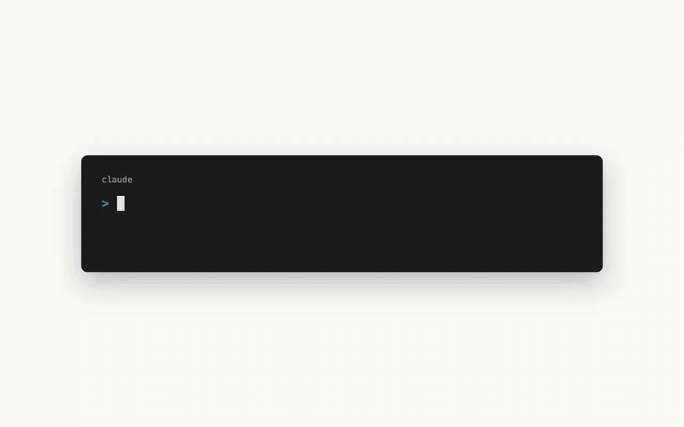
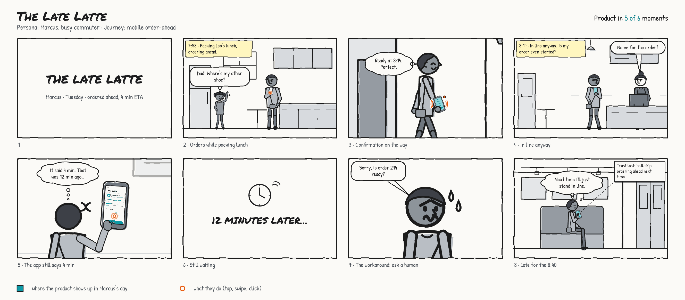
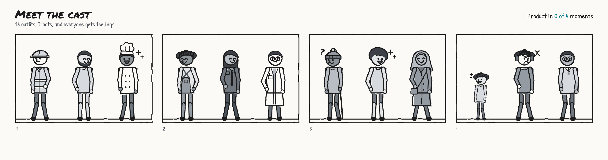

# Storyboard Kit

**Comic strips about your customers, drawn by your coding agent.**

You tell Claude Code (or Codex) what someone's day looks like. It sketches a storyboard. You poke at it in a
little editor until it feels true. Then you drop it in your deck and watch everyone realize the app is only in
3 of the 8 moments that matter.



## Why though

Most product flows start at the app's home screen. Real life doesn't. People are packing lunch, running late,
asking the barista, texting a friend, screenshotting a code because the app logged them out again.

Storyboard Kit draws all of that in a scrappy marker style where **only your product is in color (teal)**.
Everything else is grey. So the board shows, pretty bluntly, where your product helps and where people are
on their own. The header even keeps score: *"Product in 3 of 8 moments."*



## Install (about 30 seconds)

You need Node.js 18 or newer. That's it. No `npm install`, no build step, nothing native.

```bash
git clone https://github.com/jnemargut/storyboard-kit.git
node storyboard-kit/skills/storyboard/scripts/storyboard.mjs install
```

That drops the skill into `~/.claude/skills/storyboard`. Restart Claude Code and you're good.

- **Codex?** Add `--codex` to the install command.
- **Just one project?** Run `install --project` from inside that project.
- **Old school?** Copy the `skills/storyboard` folder into your agent's skills folder yourself.

## Use it

Just ask, in plain words:

> Storyboard Priya, an ER nurse, getting a shift-swap request while dropping her kid at school. The app logs
> her out, so she calls a coworker instead.

Your agent looks up what it can draw, writes `priya.storyboard.json`, checks it, runs a service-design
critique on it, and opens the editor in your browser. Then keep talking to it:

- *"make it messier"*
- *"add a panel where she gives up and calls someone"*
- *"turn on journey lanes"*
- *"export slides for my crit"*

Or just click around yourself. Your edits and the agent's edits land in the same file, live.

## What's in the box



- **A cast you build from parts.** 4 skin tones, 9 hair styles, 4 body types,
  3 ages, 16 outfits (scrubs, hi-vis, chef whites, lab coat, uniform, overalls and friends), 7 hats, plus
  glasses, canes, wheelchairs, backpacks and beards.
- **23 places.** Home, office, coffee shop, car, bus stop, gym, airport, clinic, school, parking garage, and more.
  Each one can wear your brand on its signs, or another store's name, or nothing at all.
- **11 poses from 4 angles**, 12 very readable moods (with sweat drops and little question marks), and crowds
  that don't all look like clones.
- **Camera shots** from wide to close-up, plus over-the-shoulder, straight-at-the-screen and POV.
- **10 devices.** Phones, tablets, laptops and watches can be held. Kiosks, TVs, car screens and smart speakers
  live in the scene.
- **Bubbles, captions, callouts** and title, "12 minutes later" and narration cards.
- **Taps, swipes, clicks and buzzes** in orange so they pop.
- **Your own screens.** Drop a Figma export on a phone and it turns into a teal sketch that fits the device.
- **Any picture at all.** Drag in a photo you found and it gets sketchified in greys to match (or not, your call).
- **A pen and some shapes** for anything we forgot to draw.

## The editor bits

- Click anything to get its toolbar. Drag to move, pull the corner to resize, grab the round handle to rotate.
- Double-click any text to edit it.
- Cmd+C, Cmd+V and Cmd+D copy, paste and duplicate. Cmd+] and Cmd+[ move things up and down the layers
  (add Shift to go all the way).
- Delete deletes. Cmd+Z undoes. Arrow keys nudge.
- **Journey lanes** add a strip under each panel: how the person feels, whether your product is there, and
  what workaround they used. A feeling line runs across the whole page, with every step named so you can read the journey at a glance. Click "+ name this step" under any panel to name it.
- **Ask agent** copies a precise pointer to whatever you clicked, so you can paste it to your agent and say
  "make this angrier."
- **▶ Play** turns the board into a slideshow for crit: one step at a time, full screen, arrow keys to move,
  N for speaker notes. "From here" in a panel's toolbar starts mid-story.
- **Export** to PNG, PDF, SVG, a slide deck (one panel per slide, with speaker notes) or a single HTML page
  people can leave comments on.

## Under the hood

Everything runs through one bundled script. Agents use it, and so can you:

```bash
sb() { node ~/.claude/skills/storyboard/scripts/storyboard.mjs "$@"; }

sb vocab scenes          # what can I draw?
sb validate my.storyboard.json
sb critique my.storyboard.json
sb dev my.storyboard.json
sb export my.storyboard.json --png --pptx
```

## Hacking on it

```bash
npm install
npm run build     # rebuilds skills/storyboard/
npm test          # unit tests, including a render check of every scene, pose, angle, outfit and hat
npm run e2e       # clicks around the real editor in Chrome
```

`src/vocab.ts` is the single source of truth for everything the tool can draw. The schema, the validator, the
docs and the renderer all read from it. `skills/storyboard/` is generated from `src/`, and it's checked in so
you can install straight from a clone.

## License

MIT. Fonts are Permanent Marker (Apache 2.0) plus Patrick Hand, Work Sans and IBM Plex Mono (SIL OFL).

Go draw some messy customer days.
